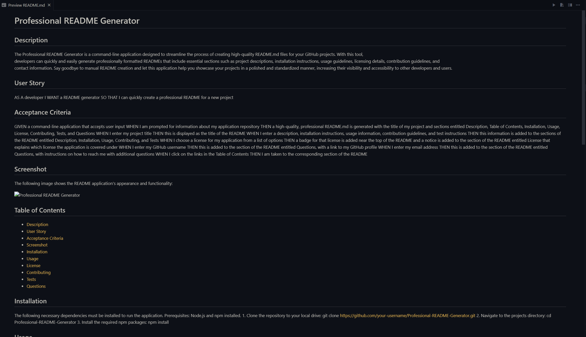

  # Professional README Generator

  ## Description
 The Professional README Generator is a command-line application designed to streamline the process of creating high-quality README.md files for your GitHub projects. With this tool,      
developers can quickly and easily generate professionally formatted READMEs that include essential sections such as project descriptions, installation instructions, usage guidelines, licensing details, contribution guidelines, and    
contact information. Say goodbye to manual README creation and let this application help you showcase your projects in a polished and standardized manner, increasing their visibility and accessibility to other developers and users.    

  ## User Story

  
  AS A developer
  I WANT a README generator
  SO THAT I can quickly create a professional README for a new project
  

  ## Acceptance Criteria

  
  GIVEN a command-line application that accepts user input
  WHEN I am prompted for information about my application repository
  THEN a high-quality, professional README.md is generated with the title of my project and sections entitled Description, Table of Contents, Installation, Usage, License, Contributing, Tests, and Questions
  WHEN I enter my project title
  THEN this is displayed as the title of the README
  WHEN I enter a description, installation instructions, usage information, contribution guidelines, and test instructions
  THEN this information is added to the sections of the README entitled Description, Installation, Usage, Contributing, and Tests
  WHEN I choose a license for my application from a list of options
  THEN a badge for that license is added near the top of the README and a notice is added to the section of the README entitled License that explains which license the application is covered under
  WHEN I enter my GitHub username
  THEN this is added to the section of the README entitled Questions, with a link to my GitHub profile
  WHEN I enter my email address
  THEN this is added to the section of the README entitled Questions, with instructions on how to reach me with additional questions
  WHEN I click on the links in the Table of Contents
  THEN I am taken to the corresponding section of the README

  ## Screenshot

  The following image shows the README application's appearance and functionality:

  
  
  ## Table of Contents
  - [Description](#description)
  - [User Story](#user-story)
  - [Acceptance Criteria](#acceptance-criteria)
  - [Screenshot](#screenshot)
  - [Installation](#installation)
  - [Usage](#usage)
  - [License](#license)
  - [Contributing](#contributing)
  - [Tests](#tests)
  - [Questions](#questions)
  
  ## Installation
  The following necessary dependencies must be installed to run the application.
   Prerequisites: Node.js and npm installed. 1. Clone the repository to your local drive: git clone https://github.com/your-username/Professional-README-Generator.git  2. Navigate to the projects directory: cd Professional-README-Generator 3. Install the required npm packages: npm install
  
  ## Usage
  To generate a professional README for your project, run the following command in your terminal: node index.js. Follow the prompts to provide information about your project, and the README.md file will be generated automatically.
  
  ## License
   This project is licensed under the [MIT License](https://opensource.org/licenses/MIT). The MIT License is a permissive open-source license that allows you to use, modify, and distribute the code in your projects. It only requires that you include the original copyright notice in your project.
  
  ## Contributing
  Contributors: N/A
  
  ## Tests
  The following is needed to run the test: To run the tests for this project, use the following command: npm run test
  
  ## Questions
  If you have any questions or encounter any issues, please feel free to [open an issue](https://github.com/mxrtinee/Professional-README-Generator/issues) or contact me directly: 
  GitHub: [Mxrtinee](https://github.com/Mxrtinee) 
  Email: hello@martinestrada.dev
